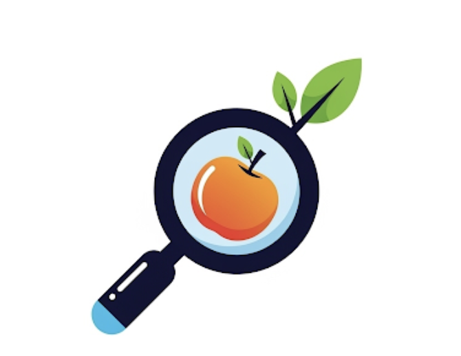

<p align="center">
  
</p>

# SafetySearch

> Search. Scan. Stay Safe.

A Model Context Protocol (MCP) server that provides access to FDA (Food and Drug Administration) data across three major categories: **Food**, **Drug**, and **Cosmetic** safety information.

## 🎯 What This Server Provides

This MCP server offers **26 tools** to access product safety data, helping users:
- Check product recalls and safety alerts
- Search drug information and interactions
- Monitor food safety issues
- Review cosmetic safety reports
- Compare FDA-regulated products
- Analyze safety trends across categories

## 🚀 Quick Start

### Prerequisites
- Python 3.8 or higher
- pip or uv package manager

### Installation

1. **Clone or download the project:**
   ```bash
   git clone https://github.com/surabhya/SafetySearch.git
   cd SafetySearch
   ```

2. **Install dependencies:**
   ```bash
   # Using pip
   pip install "mcp[cli]>=1.0.0" httpx>=0.24.0 pydantic>=2.0.0
   
   # Or using uv (recommended)
   uv add "mcp[cli]>=1.0.0" httpx>=0.24.0 pydantic>=2.0.0
   ```

## 🔧 Usage

### Development Mode (MCP Inspector)
Test and validate the server using the MCP Inspector:
```bash
mcp dev server.py
```

### Direct Execution
Run the server directly:
```bash
python server.py
```

### Install in Claude Desktop
Install the server in Claude Desktop for production use:
```bash
mcp install server.py
```

## 🛠️ Available Tools

### Food Safety Tools (9 tools)

| Tool | Description | Parameters |
|------|-------------|------------|
| `search_recalls_by_product_description` | Searches for food recalls by matching a query against the product description. | `query: str` |
| `search_recalls_by_product_type` | Searches for recalls where the product description contains a product type (e.g., 'Bakery'). | `product_type: str` |
| `search_recalls_by_specific_product` | Checks for any ongoing recalls for a single, specific food product. | `product_name: str` |
| `search_recalls_by_classification` | Searches for food recalls by a specific classification (e.g., 'Class I'). | `classification: str` |
| `search_recalls_by_code_info` | Searches for food recalls by code info (lot codes, batch numbers, etc.). | `code_info: str` |
| `search_recalls_by_date` | Searches for food recalls initiated in the last N days. | `days: int` (default: 30) |
| `get_recall_trends_by_reason` | Analyzes the most common reasons for food recalls in the last 90 days. | None |
| `search_adverse_events_by_product` | Searches for adverse event reports related to a specific food product. | `product_name: str` |
| `get_symptom_summary_for_product` | Gets a list of reported symptoms (reactions) for a specific food product. | `product_name: str` |

### Drug Safety Tools (7 tools)

| Tool | Description | Parameters |
|------|-------------|------------|
| `search_drugs` | Search for drug information by name, active ingredient, or description | `query: str` |
| `get_drug_label` | Get detailed drug labeling information including warnings and dosage | `drug_name: str` |
| `get_drug_approvals` | Get drug approvals for a specific year | `year: int` |
| `check_drug_shortages` | Check current drug shortages and availability | None |
| `search_drug_recalls` | Search for drug recalls by product name or company | `query: str` |
| `get_drug_adverse_events` | Get adverse event reports for a specific drug | `drug_name: str` |
| `check_drug_interactions` | Check potential interactions between two drugs | `drug1: str`, `drug2: str` |

### Cosmetic Safety Tools (6 tools)

| Tool | Description | Parameters |
|------|-------------|------------|
| `search_cosmetics` | Search for cosmetic products by name or description | `query: str` |
| `get_cosmetic_product_info` | Get detailed information about a cosmetic product | `product_name: str` |
| `get_cosmetic_ingredients` | Get ingredient information for a cosmetic product | `product_name: str` |
| `search_cosmetic_events` | Search for cosmetic adverse events and safety reports | `query: str` |
| `get_cosmetic_recalls` | Get recent cosmetic recalls and safety alerts | None |
| `check_cosmetic_safety` | Check safety information for a cosmetic product | `product_name: str` |

### Cross-Category Tools (4 tools)

| Tool | Description | Parameters |
|------|-------------|------------|
| `search_fda_products` | Search across all FDA categories (food, drug, cosmetic) | `category: str`, `query: str` |
| `get_fda_company_info` | Get information about a company across all FDA categories | `company_name: str` |
| `compare_fda_products` | Compare two FDA-regulated products | `product1: str`, `product2: str` |
| `get_fda_statistics` | Get FDA statistics and data for a specific category | `category: str` |

## 📋 Example Usage

### Food Safety Tools
*   **Search for recalls of "ice cream"**
    ```
    food.search_recalls_by_product_description(query="ice cream")
    ```

*   **Find recalls for "Bakery" products**
    ```
    food.search_recalls_by_product_type(product_type="Bakery")
    ```

*   **Check for recalls on "Ben & Jerry's Chocolate Fudge Brownie"**
    ```
    food.search_recalls_by_specific_product(product_name="Ben & Jerry's Chocolate Fudge Brownie")
    ```

*   **Find recalls with classification "Class I"**
    ```
    food.search_recalls_by_classification(classification="Class I")
    ```

*   **Search for a recall with code info "222268"**
    ```
    food.search_recalls_by_code_info(code_info="222268")
    ```

*   **Get all recalls from the last 14 days**
    ```
    food.search_recalls_by_date(days=14)
    ```

*   **Get top 5 reasons for recalls in the last 90 days**
    ```
    food.get_recall_trends_by_reason()
    ```

*   **Find adverse events for "Cheerios"**
    ```
    food.search_adverse_events_by_product(product_name="Cheerios")
    ```

*   **Get a summary of symptoms reported for "Lucky Charms"**
    ```
    food.get_symptom_summary_for_product(product_name="Lucky Charms")
    ```

### Drug Safety Tools
```
```

### Cosmetic Safety Tools
```
```

### Cross-Category Tools 
```
```